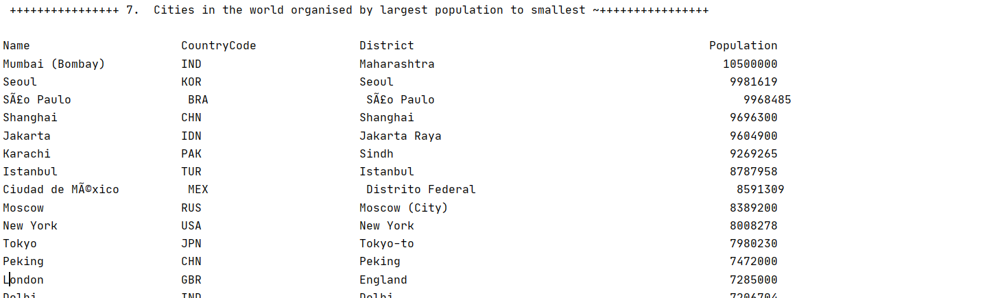
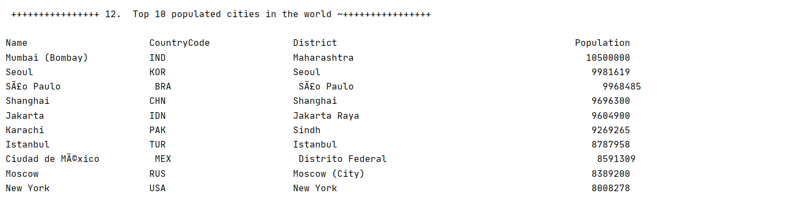

# Group4
**Team Member**

*Yadanar Kyaw*

*Kaung Satt*

*Min Thu Rein Khant*

Bandages**
=

**Master Build Status**
 
**Develop Status**

**Release Status**

**License** 

**Release** 

| ID             |                                           Name                                                  | Met  | ScreenShot  | 
| :------------- |                                       :----------:                                               |:----: | :-----------:|
|  1  |  All the countries in the world organised by largest population to smallest.                                | YES  |    |
|  2  |  All the countries in a continent organised by largest population to smallest.                              | YES  |   | 
|  3  |  All the countries in a region organised by largest population to smallest.                                 | YES  |   | 
|  4  |  The top N populated countries in the world where N is provided by the user.                                | YES  |   | 
|  5  |  The top N populated countries in a continent where N is provided by the user.                              | YES  |   | 
|  6  |  The top N populated countries in a region where N is provided by the user.                                 | YES  |   | 
|  7  |  All the cities in the world organised by largest population to smallest.                                   | YES  |   | 
|  8  |  All the cities in a continent organised by largest population to smallest.                                 | YES  |   | 
|  9  |  All the cities in a region organised by largest population to smallest.                                    | YES  |   | 
|  10 |  All the cities in a country organised by largest population to smallest.                                   | YES  |   | 
|  11 |  All the cities in a district organised by largest population to smallest.                                  | YES  |   | 
|  12 |  The top N populated cities in the world where N is provided by the user.                                   | YES  |   | 
|  13 |  The top N populated cities in a continent where N is provided by the user.                                 | YES  |   | 
|  14 |  The top N populated cities in a region where N is provided by the user.                                    | YES  |   | 
|  15 |  The top N populated cities in a country where N is provided by the user.                                   | YES  |   | 
|  16 |  The top N populated cities in a district where N is provided by the user.                                  | YES  |   | 
|  17 |  All the capital cities in the world organised by largest population to smallest.                           | YES  |   | 
|  18 |  All the capital cities in a continent organised by largest population to smallest.                         | YES  |   | 
|  19 |  All the capital cities in a region organised by largest to smallest.                                       | YES  |   | 
|  20 |  The top N populated capital cities in the world where N is provided by the user.                           | YES  |   | 
|  21 |  The top N populated capital cities in a continent where N is provided by the user.                         | YES  |   | 
|  22 |  The top N populated capital cities in a region where N is provided by the user.                            | YES  |   | 
|  23 |  The population of people, people living in cities, and people not living in cities in each continent.      | YES  |   | 
|  24 |  The population of people, people living in cities, and people not living in cities in each region.         | YES  |   | 
|  25 |  The population of people, people living in cities, and people not living in cities in each country.        | YES  |   | 
|  26 |  The population of the world.                                                                               | YES  |   |
|  27 |  The population of a continent.                                                                             | YES  |   | 
|  28 |  The population of a region.                                                                                | YES  |   | 
|  29 |  The population of a country.                                                                               | YES  |   | 
|  30 |  The population of a district.                                                                              | YES  |   | 
|  31 |  The population of a city.                                                                                  | YES  |   | 
|  32 |  The Languages from greatest number to smallest.                                                            | YES  |   | 
